# (PART) Modules {-}

# Module 1

## Lecture

<!--<iframe width="640" height="360" src="YOUTUBE EMBED LINK" title="YouTube video player" frameborder="0" allow="accelerometer; autoplay; clipboard-write; encrypted-media; gyroscope; picture-in-picture; web-share" referrerpolicy="strict-origin-when-cross-origin" allowfullscreen></iframe>
-->

<!--<iframe src="GOOGLE SLIDES LINK/preview" width="640" height="480" allow="autoplay"></iframe>  
-->

## Lab

### Creating a new repository

You can create a new repository on your personal account or any organization where you have sufficient permissions.

On the GitHub website, you can create a new repository by clicking the plus "**+**" icon on the top right toolbar. You can alternatively navigate to <a href="https://github.com/new" target="_blank">https://github.com/new</a>

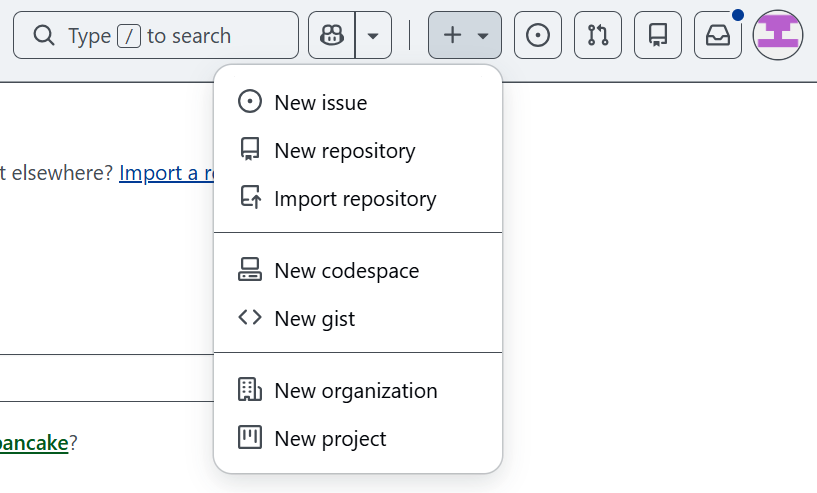

Once on the **Create a new repository** page, you can start configuring your repo. You should first verify that your account is the repo owner. If you are part of an <a href="https://docs.github.com/en/organizations/collaborating-with-groups-in-organizations/about-organizations
" target="_blank">organization</a>, you can instead choose to make that organization the owner.

GitHub always suggests a repository name you can use, or you can come up with a name on your own. In practice, it is helpful to name your repository something descriptive, but for demonstration purposes we can use the suggested name.

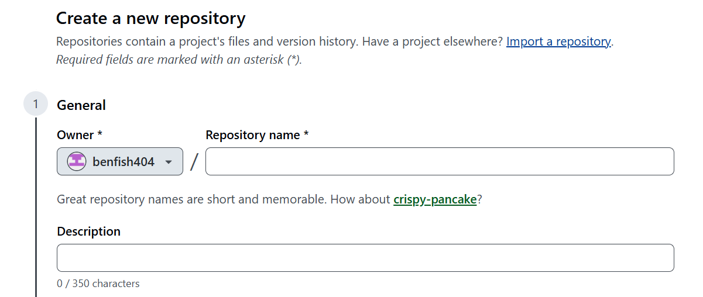


On the topic of repo names, different users can use the exact same repo name, but each user can only have unique repository names associated with their account. This means that everyone could have one repo called "ZAMBI-RDM".

Populate the name and description fields as needed. Descriptions are generally recommended but not required. Clicking on the suggested name (in this case, `crispy-pancake`) will automatically fill the name field.

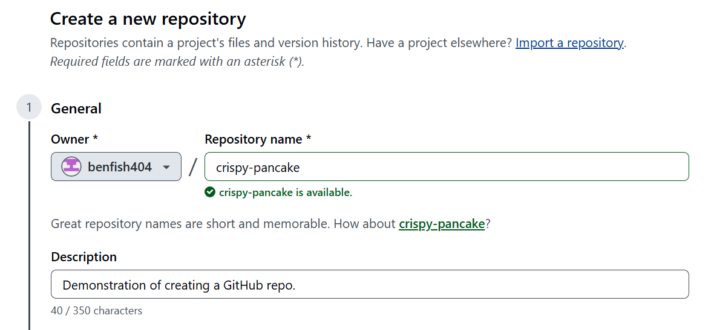

Now, we want to configure our repo. You will be met with several options under this section.

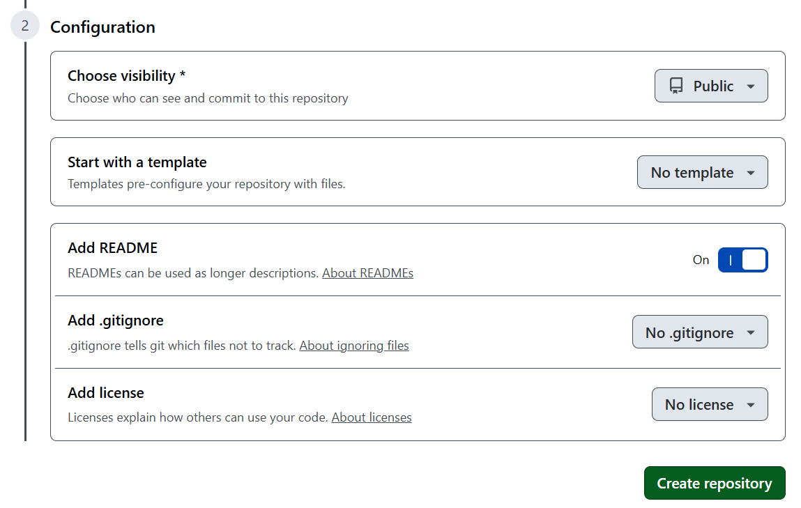

#### Visibility

Since for this demonstration our repository will not contain any sensitive information, it is okay to set our repo visibility to **public**. There are other scenarios where you may want to consider using a private repository, and you can read more about that <a href="https://docs.github.com/en/repositories/creating-and-managing-repositories/about-repositories#security-considerations-for-repository-visibility" target="_blank">here</a>.


#### Templates

You can generate a new repository with the same directory structure and files as an existing repository. This can be useful in certain scenarios, such as reducing manual configuration of repos. You can learn more about templates <a href="https://docs.github.com/en/repositories/creating-and-managing-repositories/creating-a-repository-from-a-template" target="_blank">here</a>

However, in our case, we will not use a template.

#### README

As the name suggests, **README** files are intended for other people to read in order to understand your project. README files are typically found in the top-level directory, meaning it is found within the folder that contains the entirety of your repo. A README file should be created and stored in a file format that is easily readable, such as Markdown or even plain text. The GitHub Docs provides a comprehensive overview of README files <a href="https://docs.github.com/en/repositories/managing-your-repositorys-settings-and-features/customizing-your-repository/about-readmes" target="_blank">here</a>

We will initialize our repo with a README file, which we will edit later.

#### .gitignore

You can configure Git to ignore files you don't want to track changes for with a `.gitignore` file. This can be useful when you are generating temporary files or outputs that you do not want to share with others.

There are other methods of ignoring files which will not be covered in this tutorial, but you can read more <a href="https://docs.github.com/en/get-started/git-basics/ignoring-files" target="_blank">here</a>

The dropdown menu provides several templates for populating a `.gitignore` file, however we will manually create this file later.

#### License

By default, you are considered the copyright holder of the contents you create within your repo. For open-source projects, you would instead want to choose a license for your repo that reflects your project's intended use. You can learn more about licensing your repository <a href="https://docs.github.com/en/repositories/managing-your-repositorys-settings-and-features/customizing-your-repository/licensing-a-repository" target="_blank">here</a>.

For our intents and purposes, we will accept the default of no license.

Finally, we can create our repository by clicking the green button!

Once the repo is successfully created, you will be greeted with a page that looks similar to this. Notice that your `README.md` file was populated with a description if you provided one in the previous step. Also notice that the **About** section of your repo, on the right, also contains this description if you provided one.

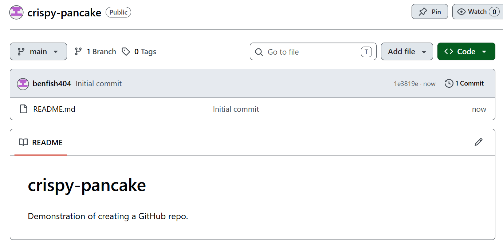


### Cloning your new repository

Now, open the GitHub Desktop app. If you have not already, you will need to sign in to your GitHub account.


To work in our repo from our local machine, we will have to obtain a copy to edit from GitHub (i.e., "clone" the repo). To do this, look along the top toolbar, and navigate to `File`, then `Clone repository...`.

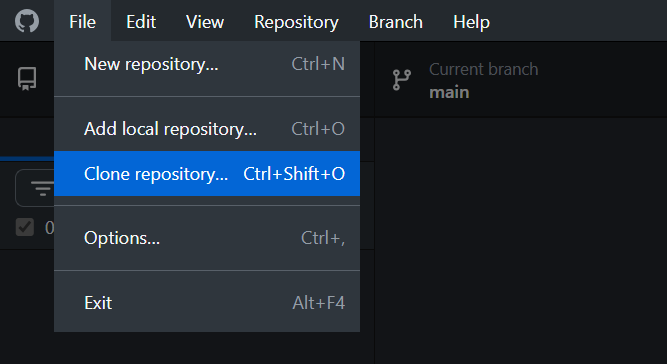

This will bring you to an interface with which you can find your repo. All of the repos you have access to should show up in the list. You can also use the search bar to locate your repository if you have many to sort through.

When cloning the repository, it will have to go somewhere on your local machine's file system. I have a folder called `github` within my `Documents` folder where I store all of my repos. You should choose a local path that works for you. Once you click **Clone**, your desired repo will be downloaded.

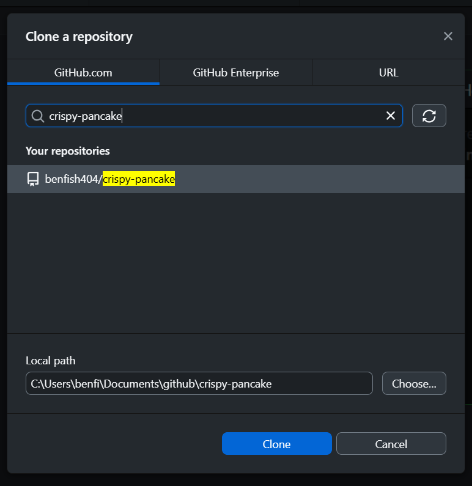

You will be greeted with a screen that looks similar to this. This is the interface which we will be using to track changes throughout our project.

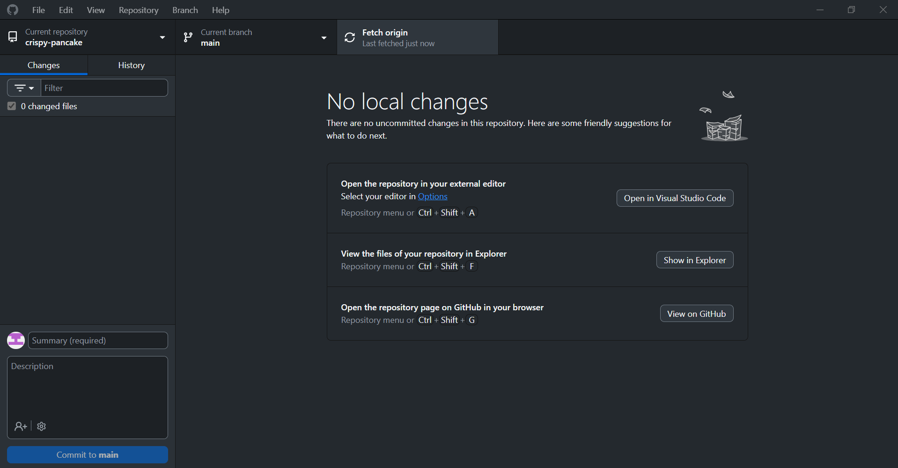

To see where our repo is stored on our machine, we can use the **Show in Explorer** button, which will open our file explorer in a new window. Within this directory, we should be able to see our `README.md` file, which is the only item we have added so far.

Note, if you have configured your explorer to show hidden items, you will also see a hidden `.git` directory which contains configurations for the repo including version control data and commit history. We can ignore this directory.

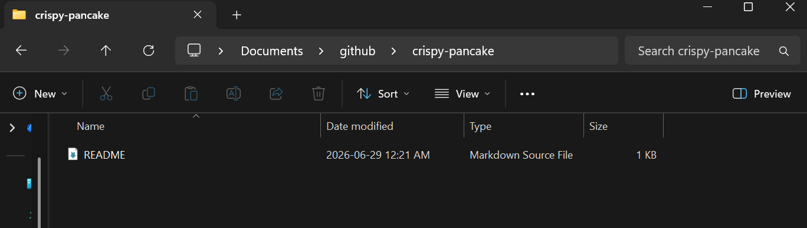

### Tracking Changes: Existing Files

Let's open the `README.md` file and make some changes. We will do this with a text editor. On Windows this will be Notepad, and on Mac this will be TextEdit. You may need to right-click the file and use the "Open with" option to select your text editor.

Once we open the file, we will see its contents.

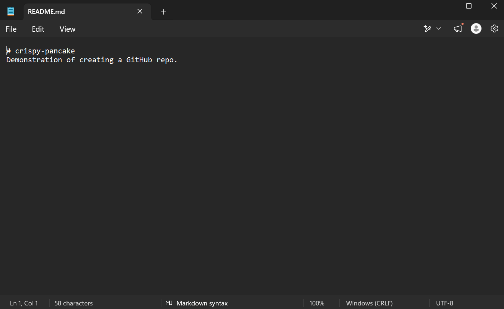 

If you are on Windows and the font sizes are different within the file, your Notepad is rendering the markdown format. To fix this, click the "Formatted" button on the toolbar at the bottom of the Window to switch to "Markdown syntax."

Let's change the file contents. Replace the contents on line 2 with the following:

```
The start of something great!
```

If we go back to our GitHub Desktop interface, it will look the same. This is because it has not yet detected that we have modified our file. For GitHub to track our changes, we actually need to save them to the file first.

Save the contents of our modified `README.md` file. Now, when we go back to GitHub Desktop, we can see that the interface has changed to reflect our changes.

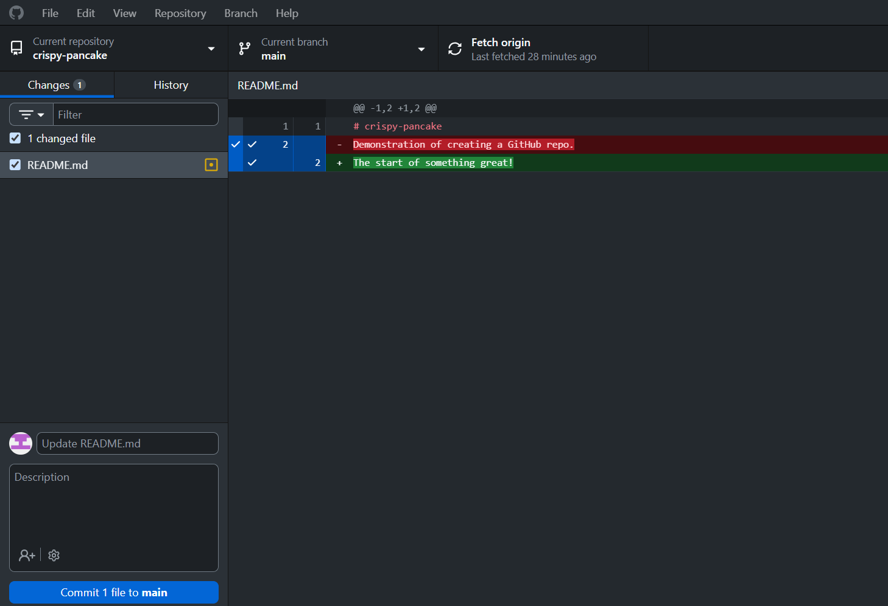 

Now, the left pane indicates that there is one changed file, which is our `README.md`. We can click on our file to inspect the changes. This type of view is called a **diff**, wherein we can compare the changes that have been made to our file compared to its previous version. This screen can tell us lots of granular information about the changes to our file.

The top line, above our file, reads `@@ -1,2 +1,2 @@` This notation summarizes the changes to the file. 

* The `@@` parts denote the start and end of the "diff hunk," which in lay terms is a section of the file that has been modified.
* The `-1,2` part indicates that one line was removed starting at line number 2.
* The subsequent `+1,2` part indicates that one line was added starting at line number 2.
  
We can also see this information visually: The **red** highlight indicates that this line was removed. The **green** highlight indicates that this line was inserted. This is because Git treats the modification of any line as a removal and subsequent insertion.

Let's suppose we've decided we want to update our description once again. In the text editor, replace the contents of line number 2 with the following:

```
A wizard is never late, he arrives precisely when he means to.
```

Now when we save the file, our GitHub screen will look like this:

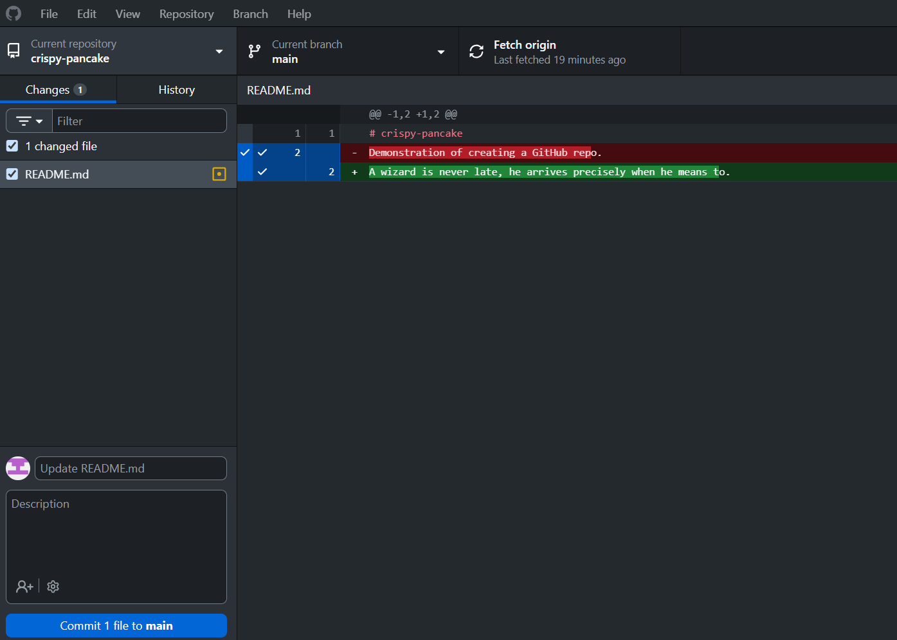 
There are two things to notice about this:

* Our previous line is no longer present in the diff view. This is because we did not stage or commit our changes to our repo. The diff only compares our local changes to the version we received when we cloned (or pulled) the origin.
* There is highlighting over most, but not all, of the diff of line 2. This is because both lines end the same way, `o.`, so this is interpreted as that part of the line being preserved.

### Tracking Changes: New Files

Within your text editor, create a new text file. This can be done with `Ctrl+N` on Windows or `Cmd+N` on Mac.

You don't need to put anything inside the text file. Go ahead and save this file **in your local repo directory** as `newfile`. A handy shortcut for saving files in the text editor is `Ctrl+S` or `Cmd+S`

Now, when we look at the GitHub Desktop interface, we see that another item, being our `newfile.txt`, has been added to the left pane. The icon next to this file is a green box with a plus sign **+**, visually telling us that this file has been added to the repo. With these icons we can quickly differentiate between files that have been created or modified.

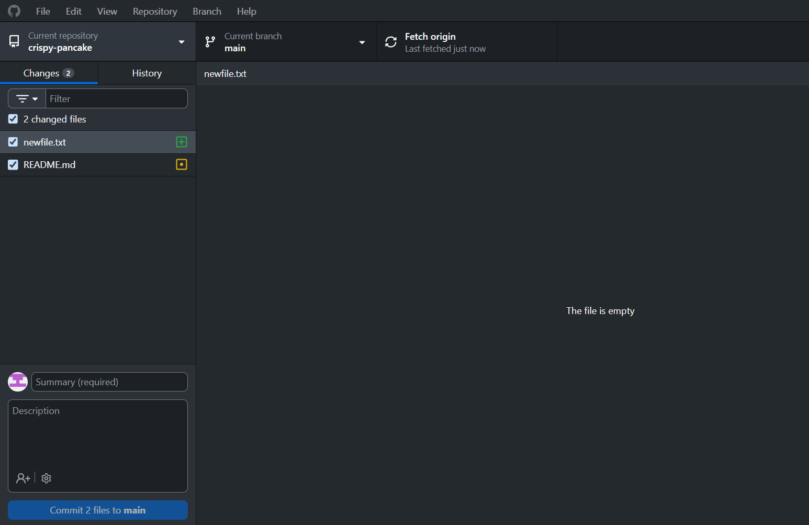
Currently, we do not see a diff for this file because it is empty. Let's add some text to `newfile.txt`. You can copy and paste the following, then save your changes:

```
Look, Ma, no hands!

```

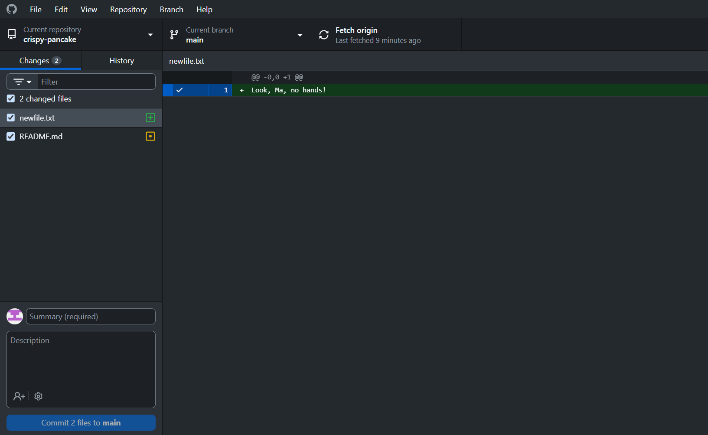

Now that our file has some contents, the diff is populated with our changes. The diff hunk notation (above the diff viewer) indicates that we _"removed nothing at line zero,"_ which is another way to say that we removed the emptiness of the file, or rather, that the file is no longer empty. It also indicates that we added content on line 1.

If you did not press `enter` after the text, you may get a warning in your Git diff saying _"no newline at end of file"_. Practically, this will not affect us but it is best practice to end files with newlines to ensure compatibility between programs.

### Tracking Changes: Removing Files

Open your file explorer and navigate to the repo directory. Delete the `README.md` file. Now, let's see how this shows up in GitHub Desktop:

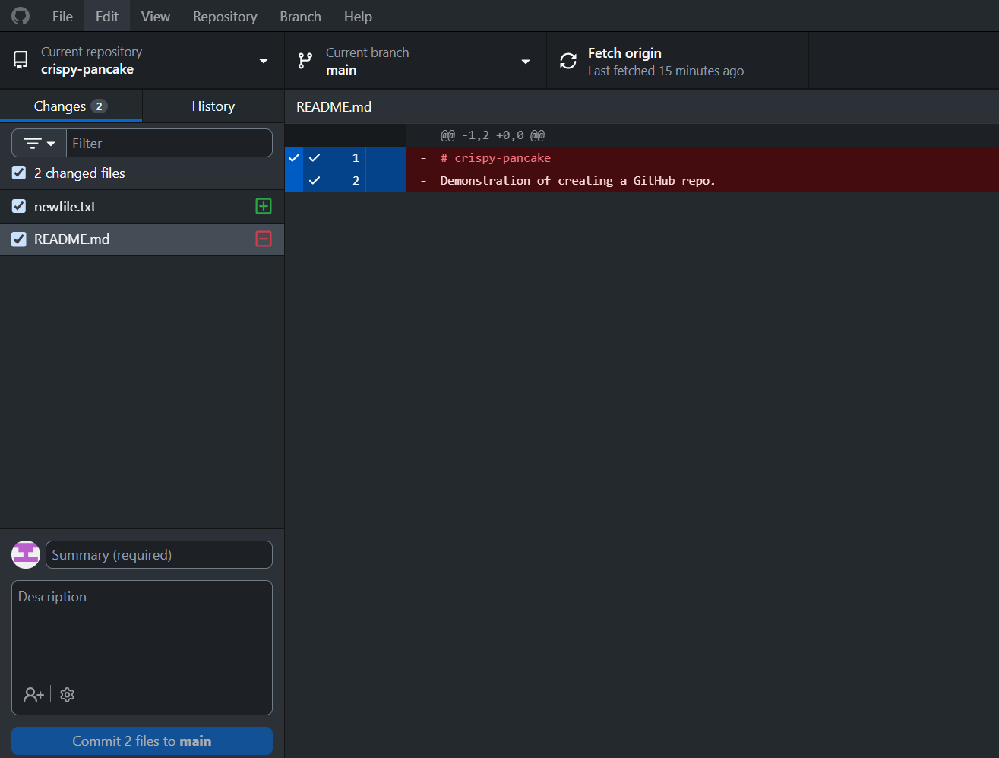 

We can see in the left pane that the yellow icon has been replaced with a red square containing a minus **-** sign. This tells us that Git has tracked the file as being removed. The diff view for this file shows us that all of its lines have been removed.


Let's now **commit** our changes to the repository. Ensure that our changes are **staged** by having checkmarks next to the filenames. Then, add a commit message, and an optional description. It is best practice to be descriptive of the changes you have made.

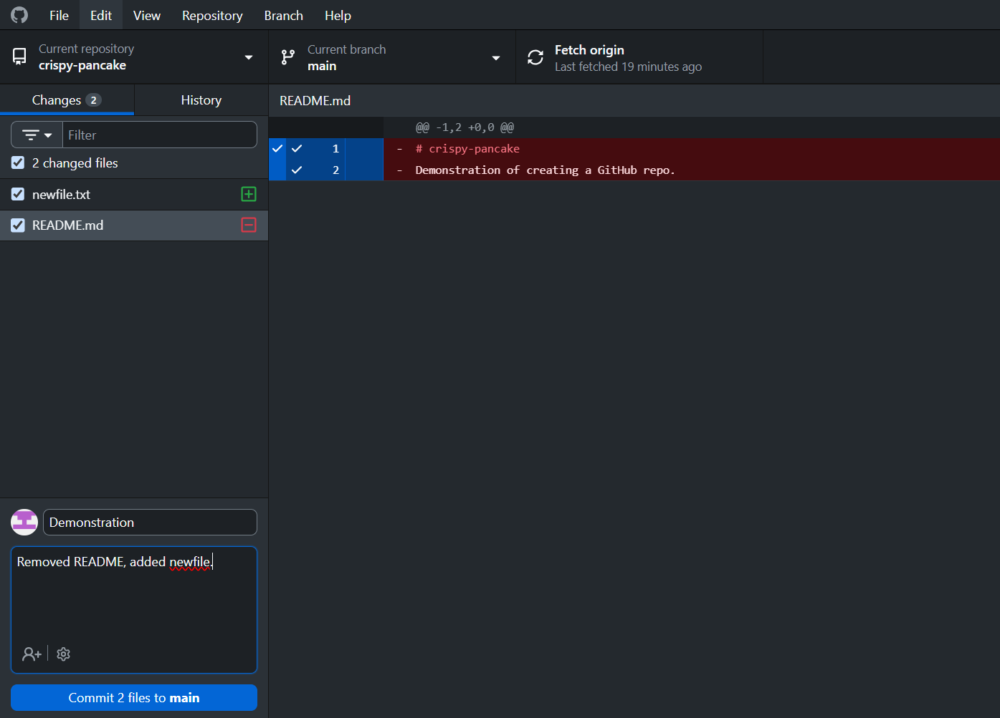

Once these fields have been populated, we can commit our changes to the **main** branch of our repo!

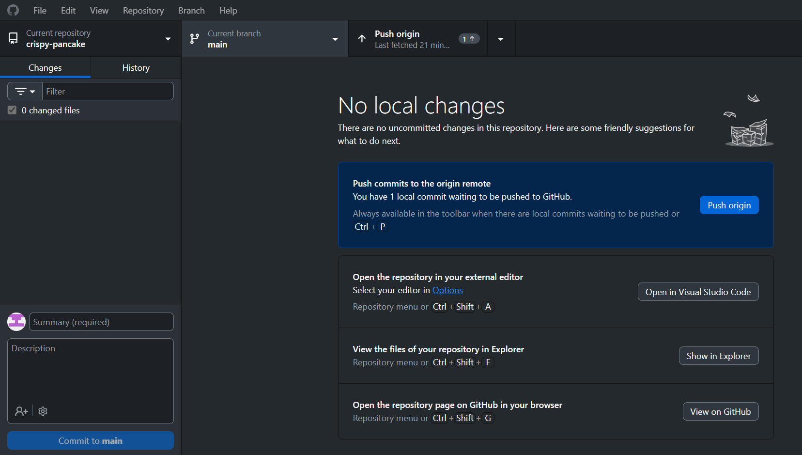


Note that our app now tells us that there are no local changes. This is because all of our files are up-to-date with the most recent commit.

Recall that commits are still stored on our local machine, and not yet pushed to the remote repo. To do this, we have to click the **Push origin** button underneath the top toolbar. The "1\(\uparrow \)" icon tells us that there is one commit that will be pushed.

Once you click **Push origin**, our changes will be sent to the remote repository. We can now visit the GitHub repo in the browser to see what has changed.

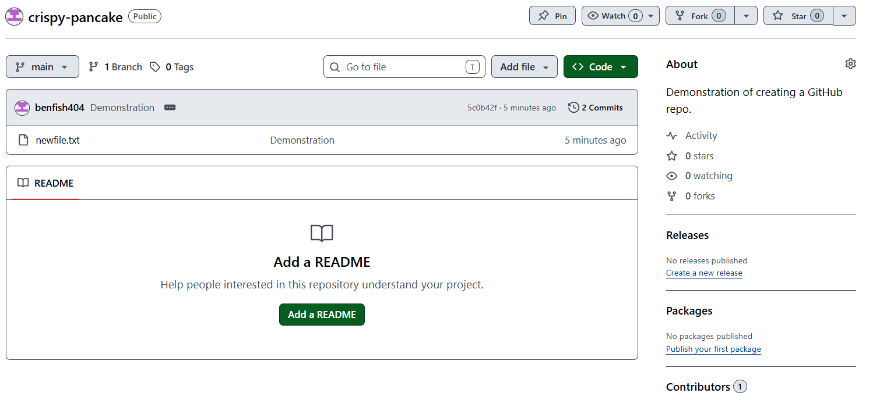 


We can also see the commit history for our repo

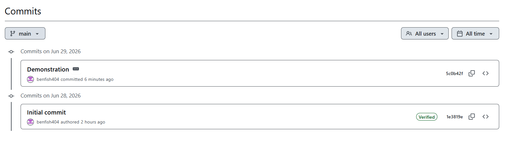

### Configuring .gitignore

First, let's make another change to our `newfile.txt`. Open this file in your text editor, and change the text: I have chosen `Look, Ma, no brains!`. Once you save this file, we will see that `newfile.txt` is in our staging area of the desktop app, and has the yellow indicator showing that the file has been modified.


Download a copy of the cookies.md file and the guacamole.md file, and add them to your repo. 

Now, we will configure our **.gitignore** for our repo.

IF you right-click on `newfile.txt` in the staging area, you have several options. We want to use the "Ignore file (add to .gitignore) option. Add `newfile.txt` to our .gitignore.

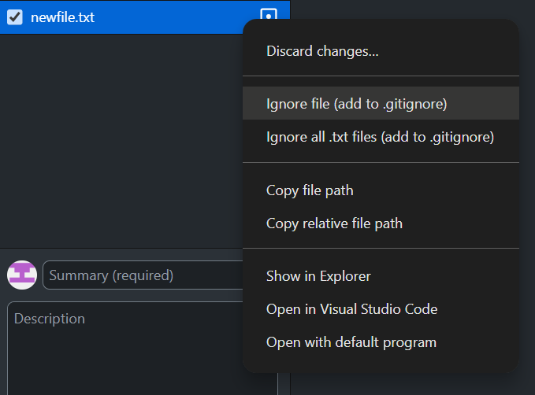


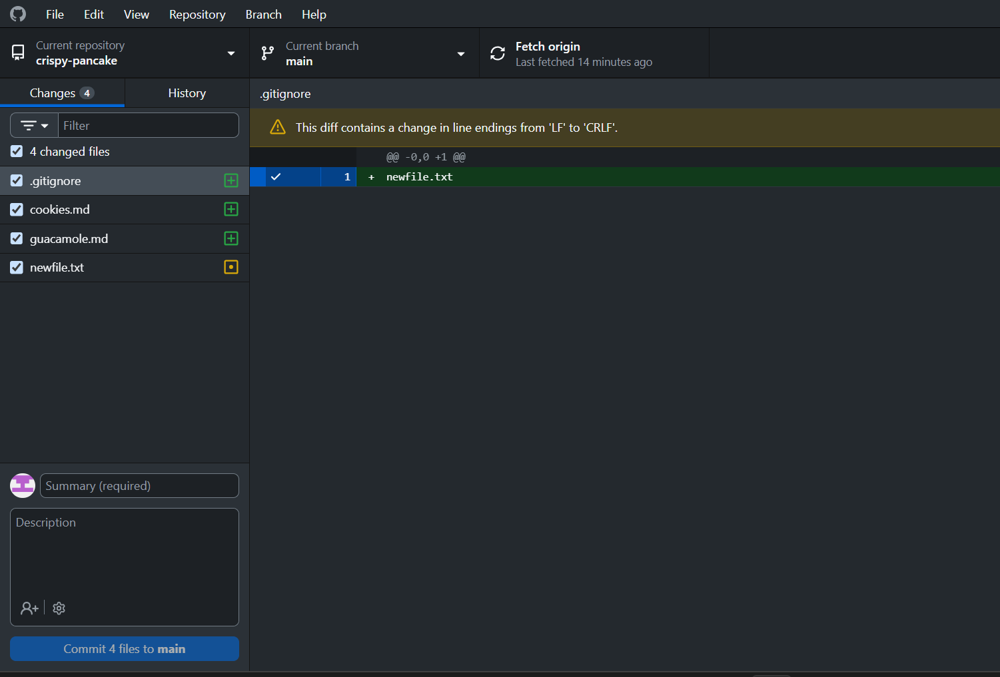 
After this, you will see that GitHub Desktop automatically created a `.gitignore` file for us. You will also see that it populated this file with `newfile.txt`, telling us that we successfully added this file to `.gitignore`.

On Windows, you may see a yellow warning that line endings have changed from `LF` to `CRLF`. This happens because the `.gitignore` was created with Unix line endings (LF) by GitHub Desktop, but it gets modified use Windows line endings (CRLF) automatically.

Now, by accessing the same options through the right-click menu, also add `guacamole.md` to the `.gitignore` file.

Question: What is another way that you could add a file, such as `guacamole.md` to the `.gitignore` file?
Answer: You could open the .gitignore file in another text editor and manually type the file name, then save your changes.

When we add `guacamole.md` to our `.gitignore`, it is removed from the staging area entirely: you can see that it is no longer in the left pane.

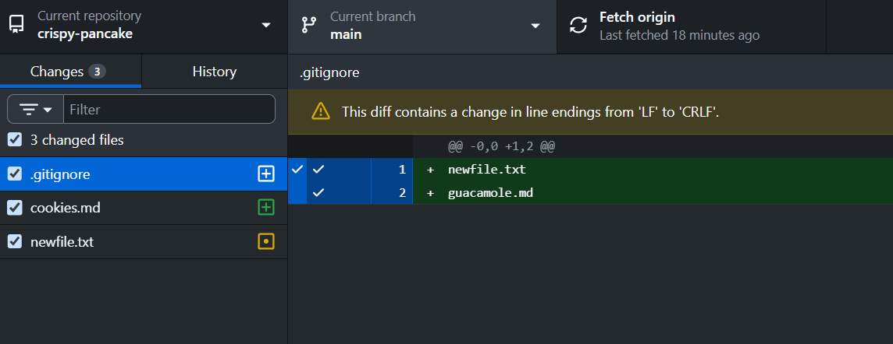 

Click **commit** and push your changes to the remote repo.

If you go to your repo on github.com/your_username/your_repo_name, you will see the results of our changes


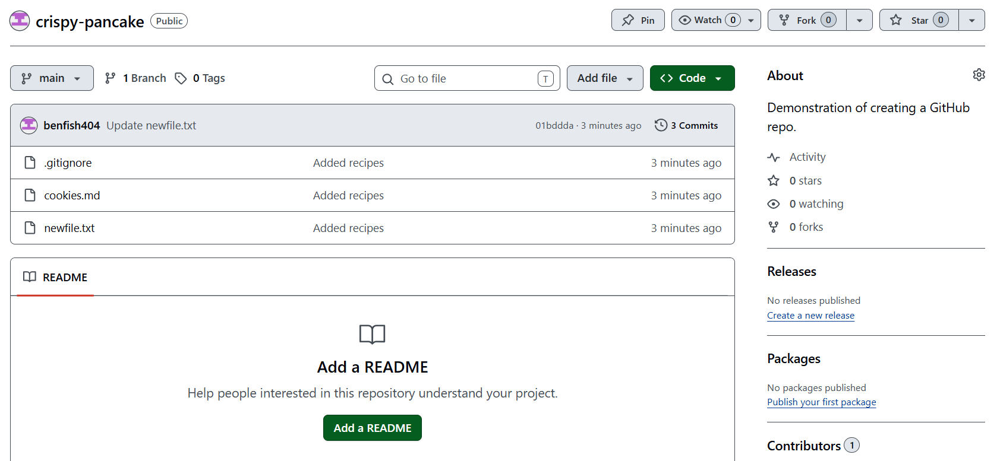 


Firstly, you can notice that the `guacamole.md` file was not added to our remote repo. This means that Git ignored changes related to that new file.

NExt, click on `newfile.txt` in your remote repo to view its contents:


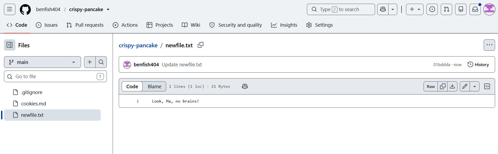 

You can see that the contents of this file **were updated**, even though we added it to our `.gitignore`.
Question: Why does this happen?
Answer: This is because Git was already tracking changes for our file. Even if we add it to the .gitignore, the precedent of its changes being tracked overrides us trying to ignore it. If we wanted to ignore the file but keep it in our local repo only, we would have to either 1) add it to .gitignore before it is created, or 2) delete the file, push our changes to the remote repo, and create the file again on our local repo.


On our local machine now, let's modify our `.gitignore` file manually. Open the file in a text editor, with which you should see the following:


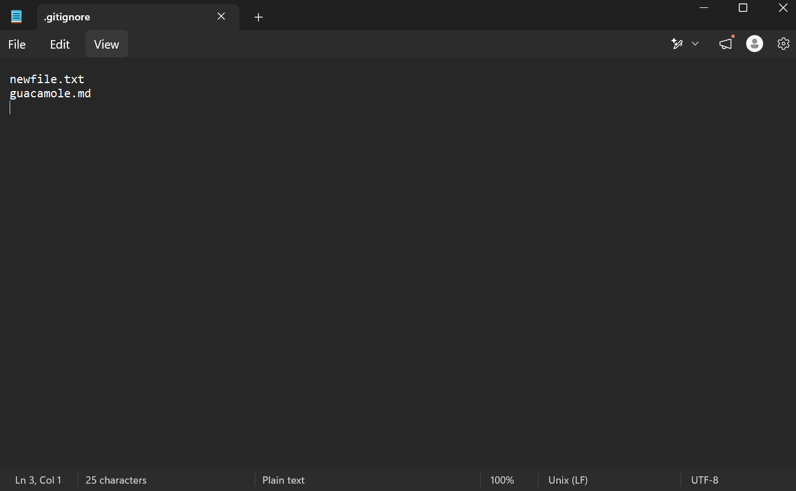 

Since our repo will not be ignoring `newfile.txt` anyway, we can remove that item. Let's also remove `guacamole.md` from the `.gitignore` file. After doing this, you should have an empty file, and the diff in GitHub desktop should look like this:


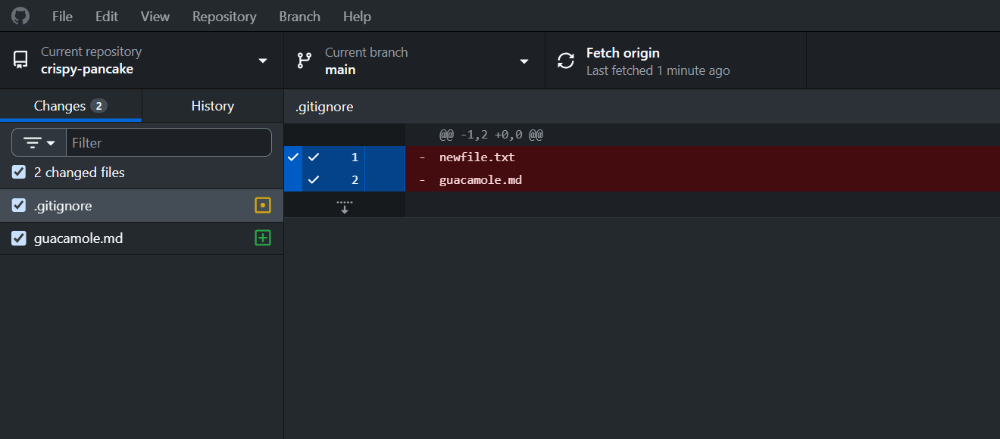 

Notice now that `guacamole.md` is in the staging area. Now that Git is tracking changes for this file, the creation of this file in our repo is now detected.

Before moving on, **commit** and push these changes.

### Creating a Branch


We will now demonstrate creating a branch of our repo. Recall that a branch begins by taking a snapshot of our repo at that moment in time.

Question: Does the branch copy the local repo or the remote repo?
Answer: It depends on where you initiate the branch creation from. If you do this locally, as we will in this demonstration, it will create a copy of the local repo. If you create a branch from the remote repo (i.e. on the GitHub website) it will create a copy of that version of the repo. This is why it's important to sync local changes with the remote repo!

Create the new branch by using the "Current branch" dropdown menu, and clikcing on the __New branch__ option.


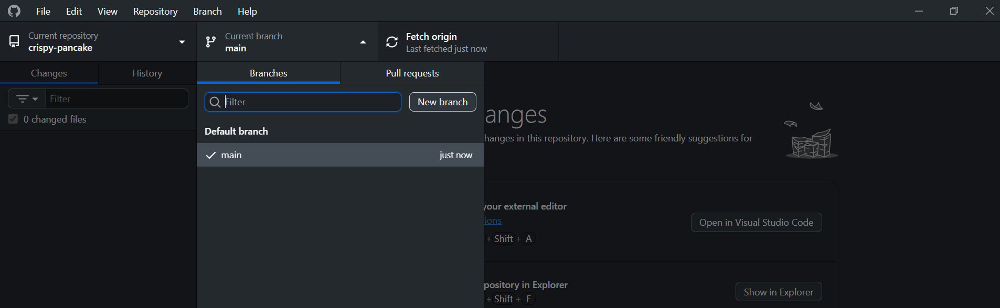

We will be prompted to name the branch; let's use `development` to differentiate it from the purpose of our __main__ branch.

Click **Create branch** to finish creating our new branch.


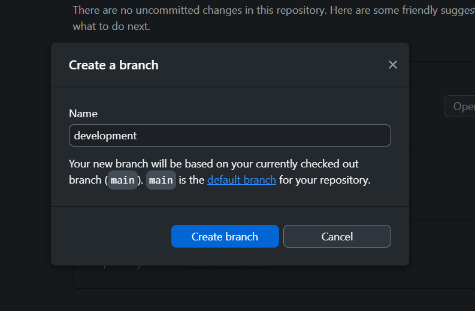


When the branch is successfully created, this will bring us to a familiar interface. However, note that our **Current branch** was automatically switched from __main__ to __development__.

Importantly, this branch only exists locally right now. If we want it to show up in our remote repo, we have to use the **Publish branch** button near the top-center of the interface.

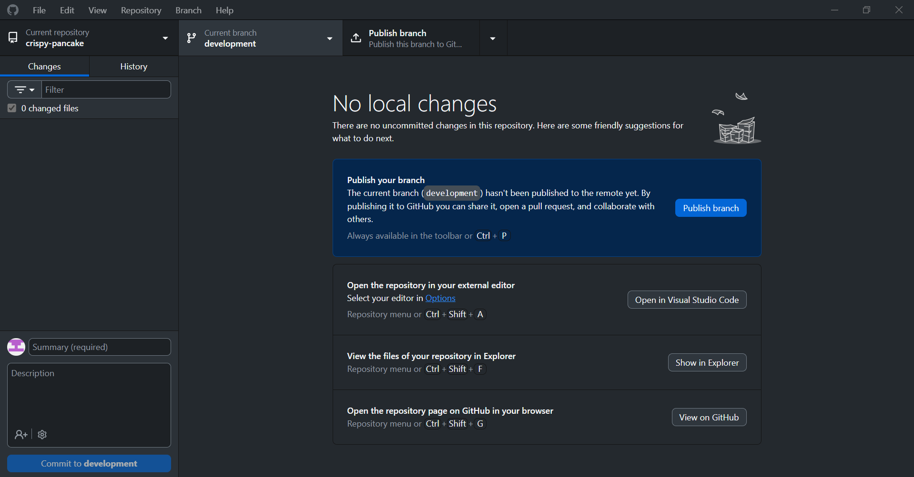

Let's make some changes in our `development` branch. Create a new file called `README.md`. In the text editor, this can be done by manually adding the `.md` file extension to the file name, and __not__ saving as a `.txt` file.

Add the following contents to your new markdown (.md) file, and save your changes:


``````
# Project Notes

## Overview

This project provides tools for processing customer data.

## Installation

1. Clone the repository.
2. Install dependencies:
   ```bash
   npm install
   ```
3. Start the application:
   ```bash
   npm start
   ```

## Configuration

Set the following environment variables:

- `API_URL=https://api.example.com`
- `LOG_LEVEL=info`

## Contributing

Please open an issue before submitting a pull request.
``````

In the staging area, we see that Git is tracking the creation of our file.


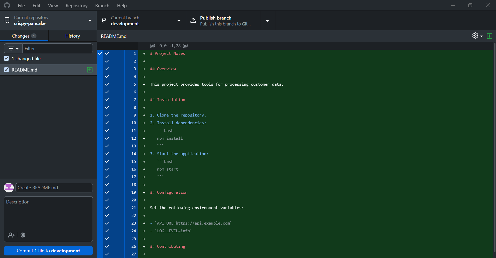

If you have staged changes, as we do here, that are not yet committed, you will need to click **publish branch** before switching to another branch, otherwise your local changes will be __brought into the next branch you open__. If you try to do this on GitHub Desktop, you will get a warning.

Once our branch is published and our changes are committed, we can push these changes to the remote repo.

### Merging a Branch

We currently have two branches of our repo. Let's suppose we want to merge them into one. On GitHub desktop, change your current branch from __development__ to __main__ using the dropdown menu.

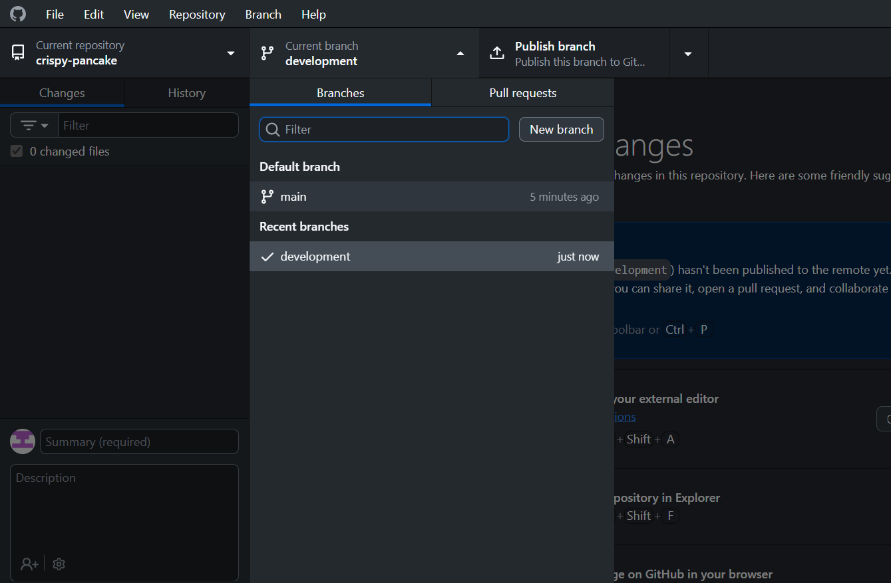

Once we have successfully changed branches, we can see that our current branch is indicated to be __main__ again.

Note that changes which we made to the __development__ branch are not in the staging area of __main__ since the history of these branches is now being tracked separately.

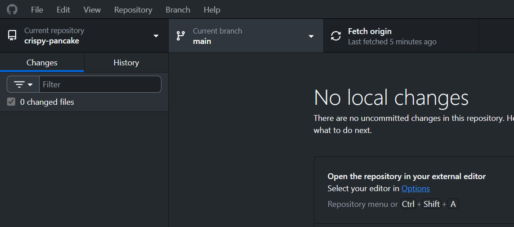

To initiate a merge, start by using the "Choose a branch to merge into main" button at the bottom of the branch dropdown menu.


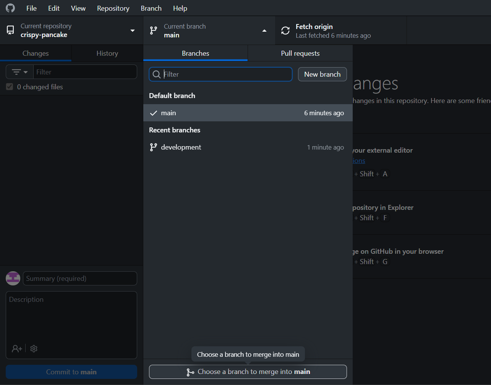
This will give us the option to select our __development__ branch as the one we want to merge into __main__.

When GitHub tries to merge two branches, it uses an algorithm to consolidate changes that were made in the same files (in our case, the `README.md`). In this case where branches with committed changes are being merged, GitHub is able to merge our changes without issue, as indicated by the message at the bottom of the popup. 

Click on **Create a merge commit** to start the merge.


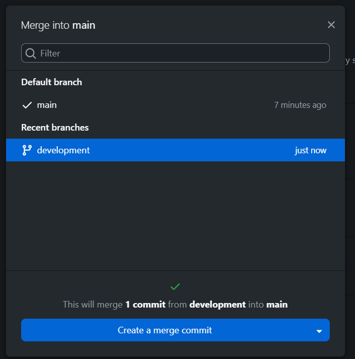

If successful, we will receive a message above the staging area that we have successfully merged **development** into **main**.

Question: Where does the __development__ branch go after merging it into __main__?
Answer: The branch still exists. Now, however, its current state is the same as that of the main branch. Importantly, the tracked changes of the development branch are independent of the main branch, BUT the main branch now contains the tracked changes made to both its branch and the development branch.


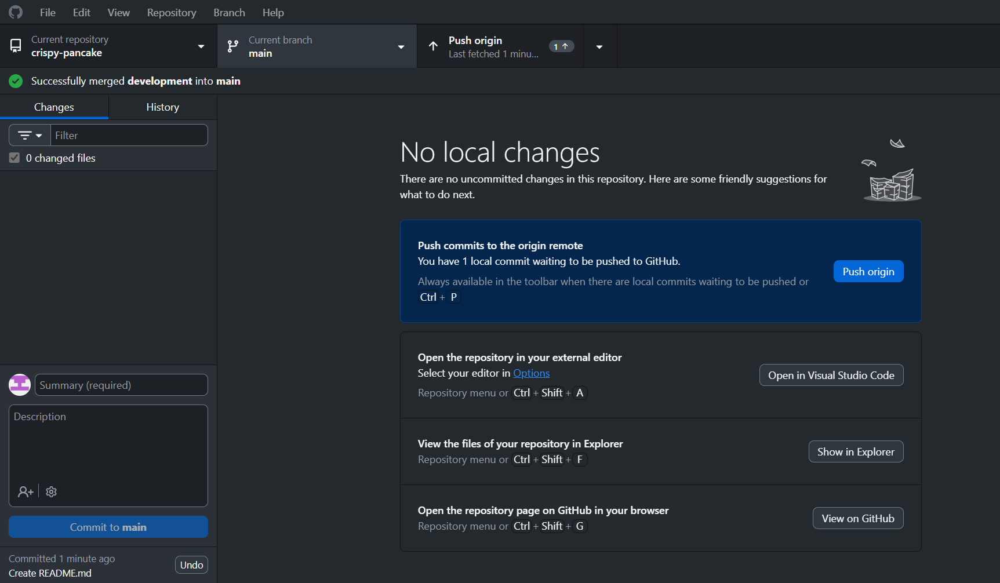

Before moving on, **Push** your changes to the remote repo.

#### Conflict Resolution

We are going to intentionally create a merge conflict in order to demonstrate how they are resolved.

In the __main__ branch, open `README.md` and add the following text on line 2:

```
Status: in progress...
```

Then, commit these changes to the local repo but DO NOT push them to the remote repo.


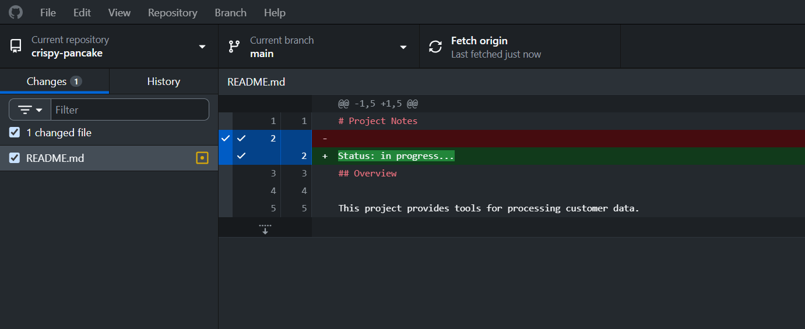


Now, switch the **Current branch** from __main__ to our development branch. Similarily, open the `README.md` file and add some __different_ text on line 2, such as:

```
Status: draft.
```

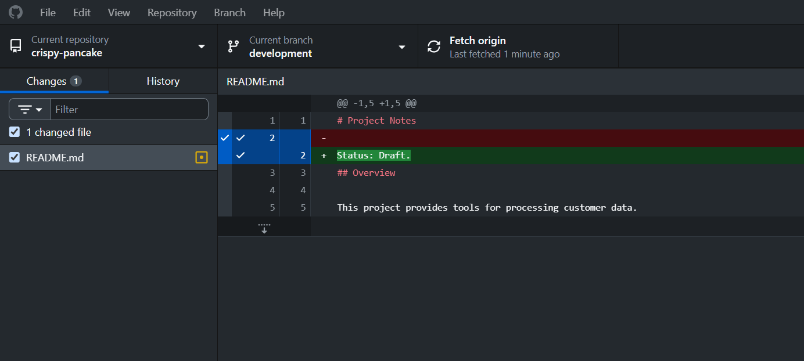


**Commit** these changes to the local repo, but DO NOT push them to the remote repo.


Similarily to before, we will initiate a merge of our branches. 


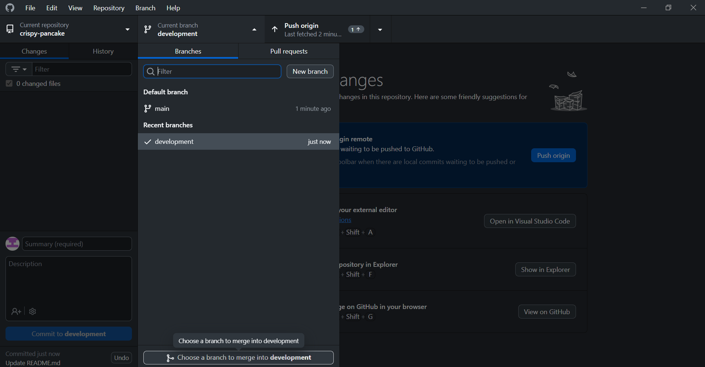

This time, we will merge our __main__ branch into the __development__ branch, instead of the other way around. This is contrary to common practice but it can be done.

When we are preparing this merge, we get the following warning:


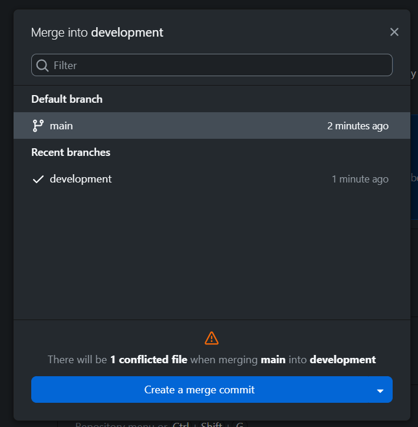

This means that GitHub has detected we have changes in our local branches that conflict with each other. We can still create a merge commit, however we will have to manually resolve this conflict.

Click on **Create a merge commit** to continue.

We will be greeted with the following popup once we initiate the merge of our branches. Notice that we cannot "Continue merge" until the conflicts are resolved.

There are some external tools which can be used for resolving complicated conflicts, however for our purposes we will fix our `README.md` manually.

To do this, click on "Open in Visual Studio Code"


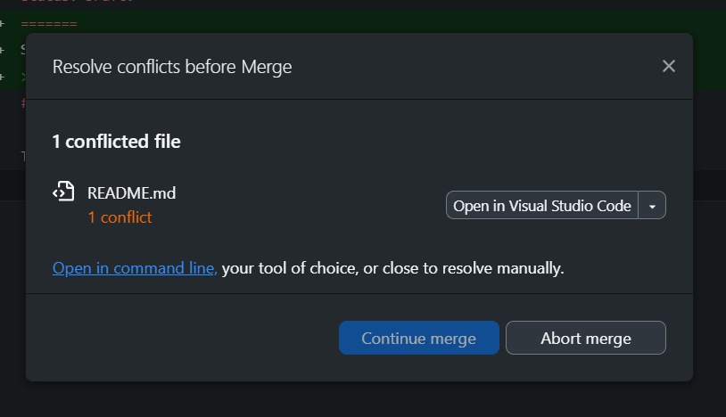

You will be greeted by a screen that looks similar to the following:

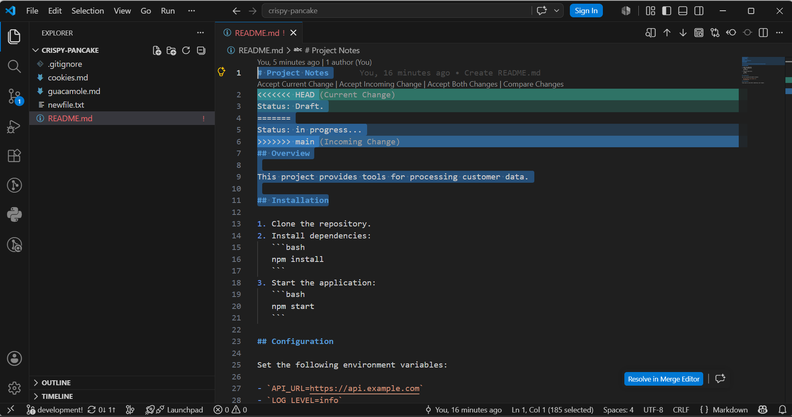


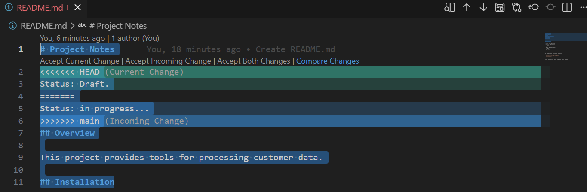

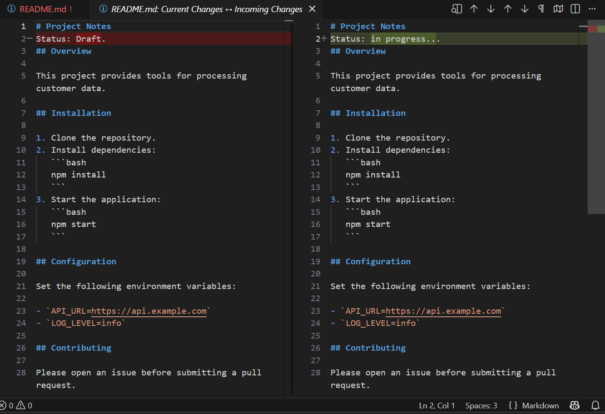


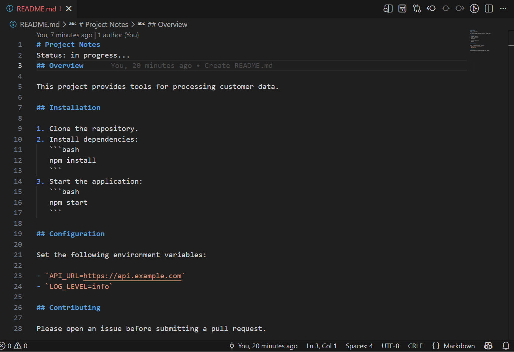


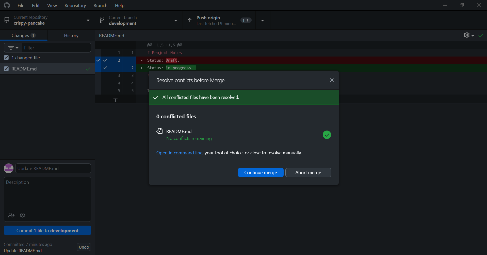


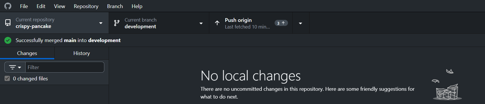


``````
# Project Notes
<<<<<<< HEAD
Status: Draft.
=======
Status: in progress...
>>>>>>> main
## Overview

This project provides tools for processing customer data.

## Installation
...
``````
